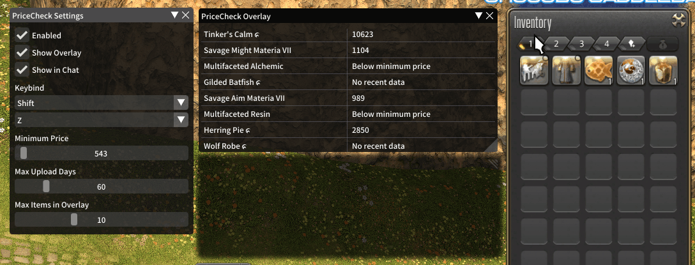

# PriceCheck

Dalamud plugin to quickly check item prices. Simply hover over an item in your inventory or linked in chat while holding your keybind. The average price from Universalis will display based on the item quality.

## Preview

 

## Commands

**/pricecheck** or **/pcheck** to open the overlay. 
**/pricecheckconfig** or **/pcheckconfig** to open the configuration options. 

## Configuration
**Enabled** - toggle the plugin off/on. 
**Show Overlay** - show price check results in overlay window. 
**Show in Chat** - show price check results in chat (echo). 
**Keybind** - set your modifier and primary keybinds (e.g. SHIFT+Z). 
**Minimum Price** - set minimum price at which actual average will be displayed. 
**Max Upload Days** - set maximum age to avoid using old data. 
**Max Items in Overlay** - set max number of items in overlay at a time. 
